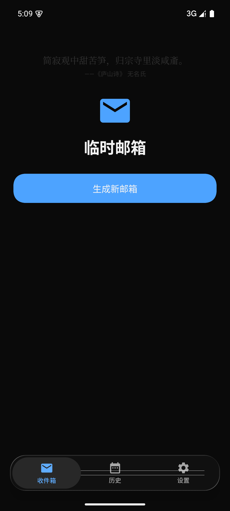
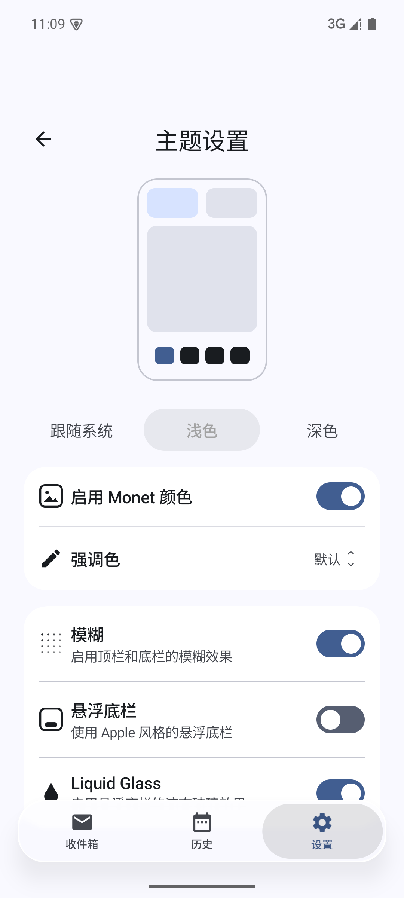

# TempMail · Liquid Glass 底栏

> 一个 Android 临时邮箱应用（Jetpack Compose + Material 3），
> 同时是一份**完整的、可参考/可二次开发的「液态玻璃底栏」开源实现**：
> 真实模糊 + 边缘折射 + 色散 + 按压放大镜 + 拖动切换 Tab。

[](LICENSE)
[](https://developer.android.com)
[](https://kotlinlang.org)
[](https://developer.android.com/jetpack/compose)
[](https://github.com/compose-miuix-ui/miuix)

- 底部导航栏（Liquid Glass）：**API 33+ 且设备支持 AGSL 时启用**，低版本/不支持时自动回退到原有底栏
- 宿主应用：临时邮箱（生成邮箱 / 收件 / WebView 渲染正文 / 15 种语言 / 自动更新）

---

## Preview

| 浅色 · 静止 | 浅色 · 按下（放大镜） |
|---|---|
|  |  |

| 深色 · 静止 | 深色 · 按下（放大镜） |
|---|---|
|  |  |

> 截图取自 Android 15（API 35，1080×2400）模拟器，应用 2.0.0 版本，主题 = Miuix(HyperOS)、底栏风格 = Liquid Glass。
> 截图时页面背景为纯色，因此"模糊"不明显（模糊/色散在有文字或图片滚过底栏时最直观）；
> 下图裁剪自同一组截图，用于看清"按下 = 放大镜"的形态差异：

### 莫奈取色 · 主题设置（v2.1.0）

| 浅色 + Monet（种子 = 默认主色蓝） | 深色 + Monet（种子 = 预设橙） |
|---|---|
|  |  |

> Miuix 主题下的「主题设置」页：预览示意图 / 明暗三选一 / 启用 Monet 颜色 + 强调色 / 底栏选项。
> 完整实现说明见 [docs/monet-theme.md](docs/monet-theme.md)。

---

## Features

### 底栏特性（本项目重点）

- **真实背景模糊**：底栏采样其下方内容（`LayerBackdrop`）做 4dp 模糊 + 饱和度增强（vibrancy 1.5），不是半透明色块
- **边缘折射（Lens）**：AGSL 圆角矩形 SDF，把玻璃边缘的采样坐标向外偏移，形成"厚玻璃"的透镜折射
- **色散**：选中胶囊按住时按 X·Y 位置做色散（chromatic aberration），出现隐约的红/蓝色边
- **按压放大镜**：按住（或拖动）时选中胶囊放大到 1.39×（78/56）并折射、放大其下方图标（图标被染成主色后放大）
- **按住拖动切换**：按住底栏横向拖动即可切换 Tab，拖动时玻璃厚度/拉伸随速度与拖动幅度"流动"
- **惯性吸附**：松手按 位置 + 速度 × 0.22s 预测目标 Tab，快速甩动即使没拖过中点也能切到相邻 Tab
- **越界橡皮筋**：拖出两端时整条底栏最多位移 4dp（Tab 区间内拖动底栏本体不位移）
- **重力高光**：1dp BloomStroke 镜面高光，光源方向随重力方向按 3° 量化旋转，静止时朝上
- **胶囊内阴影**：non-API 级 `Modifier.innerShadow`（GraphicsLayer + BlurEffect + Clear 遮罩）
- **可切换 / 可回退**：Material3 底栏、Miuix 悬浮底栏、Miuix 伪玻璃底栏、真·液态玻璃底栏四态共存（见 Architecture）

### 宿主应用功能

- 临时邮箱：一键生成邮箱、刷新收件、复制地址、历史邮箱复用
- 邮件详情用 WebView 渲染 HTML，链接/按钮/验证码快捷复制
- 15 种语言、明暗三态（跟随系统 / 浅色 / 深色）、主题风格（Material3 / Miuix）与底栏风格切换
- **莫奈取色（Monet 动态配色）**：从图片或预设色取出一个种子色，推导出整套配色——
  Material3 走 MCU 生成完整 ColorScheme，Miuix 复用同一份 scheme 映射到 Miuix 色板；
  详细说明见 [docs/monet-theme.md](docs/monet-theme.md)
- 启动时检查 GitHub Release 更新，下载 APK 并做 SHA-256 校验后安装

---

## Architecture

### 三条互不干扰的底栏路径（关键设计）

```
状态：themeStyle ∈ { Material3, HyperOS(Miuix) }  ·  barStyle ∈ { Float, LiquidGlass }

┌─ Material3 主题 ─────────────► Material3 NavigationBar（项目原有，未改动，也是所有降级路径的最终兜底）
│
├─ Miuix 主题 + 悬浮 ──────────► MiuixFloatingBottomBar（Miuix 悬浮底栏）
│
└─ Miuix 主题 + Liquid Glass ─┬─ isGlassBlurSupported() == true ─► ui/glass/ 真·液态玻璃（本次实现）
                              └─ false（API < 33 / AGSL 不可用）─► LiquidGlassBottomBar（自绘渐变伪玻璃，回退）

isGlassBlurSupported() = SDK_INT >= 33 && isRuntimeShaderSupported() && AGSL 探针可编译
```

- Material3 底栏分支**完全保持原样**，玻璃分支不向它注入任何 import 或参数
- 真玻璃分支全部隔离在 `ui/glass/`，低版本设备不会加载 `miuix-blur` 的类（Manifest 用 `tools:overrideLibrary` 放行 minSdk 差异）

### 渲染管线

```
1) 内容层：Scaffold(Modifier.layerBackdrop(backdrop))，backdrop = rememberLayerBackdrop { drawRect(surface); drawContent() }
2) 底栏层：Modifier.drawBackdrop(backdrop, shape = RoundedCornerShape(28dp)) {
       effects  { padding(40dp); vibrancy(); blur(4dp); lens(24dp, 24dp) }   // 只更新 shader uniform，不重建 RenderEffect 链
       highlight{ BloomStroke(1dp, white 0.12) 随重力旋转 }
       layerBlock { 按住鼓起 6dp + 速度拉伸 ≤1% + 拖动叠加 ≤0.4% }           // 底栏本体"微动"
       onDrawSurface { surface.copy(alpha = 0.35f) }                          // 奶玻璃底色
   }
3) 图标镜像层：同结构 Row，alpha = 0f，挂 layerBackdrop(tabsBackdrop)（唯一作用是让胶囊能采样到"被放大并染色的图标"）
4) 选中胶囊：宽 = tabWidth、高 56dp，translationX = value × tabWidth，
   drawBackdrop(CombinedBackdrop(内容层, 图标层)) { lens(10dp·s, 14dp·s, depthEffect, 色散 0.5) ; layerBlock { 1.39× } }
5) 手势层：matchParentSize 的透明 Box（最后绘制 = 命中优先级最高）自处理 按下 / 拖动 / 点击
6) 页面：内容不做底部避让，改为在滚动内容末尾预留 GlassBarSpace(88dp)
```

### 关键实现要点

| 问题 | 做法 |
|---|---|
| 手势与子项点击冲突 | 手势放在顶层透明覆盖层（`awaitEachGesture` + 位移累加 + `consume()`），点击由"位移 < 8dp"判定 |
| **部分 ROM 收不到父级指针事件** | 父级 `pointerInput`（Initial/Main pass）在 ColorOS（API 36）真机上完全收不到事件，故改为顶层覆盖层方案 |
| 拖动切换与"选中态"同步 | `DampedDragAnimation.value` 是浮点 Tab 位置，`onDragStopped` 用 位置+速度 预测后回调 `onSelect` |
| 拖动幅度驱动玻璃 | `dragFlow = abs(value - round(value)) * 2`（0=停在 Tab 中心，1=处于两 Tab 之间），无需额外状态 |
| 性能 | 所有动画值只在 `effects` / `layerBlock` / `drawWithContent` 中读取 → 只触发重绘不触发重组；模糊半径固定常量，避免每帧重建 RenderEffect 链 |

### 源码结构（底栏相关）

| 文件 | 行数 | 职责 |
|---|---:|---|
| `ui/glass/GlassBottomBar.kt` | 869 | `GlassShell` / `GlassBar` / `GlassBarTabItem`、手感常量、能力判定与降级、`CombinedBackdrop`、重力高光、`vibrancy()` / `lens()` / 两套 AGSL 着色器、`GlassBarSpace` |
| `ui/glass/GlassInteraction.kt` | 318 | `DampedDragAnimation`（value / velocity / pressProgress / dragFlow、press / release / updateValue）、`InteractiveHighlight`（按压光斑）、手势工具 |
| `ui/glass/InnerShadow.kt` | 140 | `InnerShadow` + `Modifier.innerShadow`（胶囊内阴影） |
| `ui/theme/MiuixComponents.kt` | 523 | Miuix 主题桥接：`MiuixThemeIfNeeded`、`hyperMiuixColors` / `dynamicMiuixColors`、`ThemedCard/Switch/Button/TextButton/IconButton/Divider/LinearProgress/SegmentedTabs/ListRow/DropdownValue` |
| `ui/theme/Theme.kt` | 174 | 主题装配：seed → ColorScheme → `MaterialTheme` + `MiuixTheme`；`ThemeStyle` / `ThemeMode` 分支 |
| `ui/theme/dynamic/DynamicColorSchemes.kt` | 134 | seed → 完整 Material 3 双套配色（MCU，纯函数）、`DynamicStyle`、`NoDynamicSeed` |
| `ui/theme/dynamic/SeedExtractor.kt` | 46 | 图片 → 种子色（降采样 + androidx.palette） |
| `ui/theme/dynamic/MonetPresets.kt` | 20 | 内置预设色 + `DefaultMonetSeed` |
| `MainActivity.kt` | 3104 | 应用全部逻辑（单文件架构）+ 底栏装配点（`glassActive` 判定、`GlassShell` 调用）、设置页与莫奈取色 / 主题设置两个子页 |

---

## Requirements

| 项 | 版本 |
|---|---|
| JDK（运行 Gradle） | **JDK 24**（JDK 25 会让 Kotlin 2.4 编译器的版本解析崩溃） |
| Kotlin / Compose 编译器插件 | 2.4.20 |
| Compose BOM | 2026.05.01（ui / foundation 1.11.2、material3 1.4.0） |
| AGP / Gradle | 8.13.0 / 8.14.4 |
| compileSdk / targetSdk / minSdk | 37 / 34 / **24** |
| 玻璃效果运行要求 | **API 33+ 且 RuntimeShader(AGSL) 可用** |

> 说明：`miuix-blur` 声明 minSdk 33，本应用保留 minSdk 24 并用
> `<uses-sdk tools:overrideLibrary="top.yukonga.miuix.kmp.blur" />` 放行，运行时按 API 分级降级。
> Miuix 0.9.3 要求 compileSdk ≥ 37，AGP 8.13 官方只测到 36.1，故 `gradle.properties` 需要 `android.suppressUnsupportedCompileSdk=37`。

---

## Installation / Integration

把底栏搬到自己的 Compose 项目（可只搬底栏，不必搬整个应用）：

### 1. 依赖

```kotlin
dependencies {
    val miuixVersion = "0.9.3"
    implementation("top.yukonga.miuix.kmp:miuix-blur-android:$miuixVersion") // 必需：backdrop/模糊/折射
    implementation("top.yukonga.miuix.kmp:miuix-ui-android:$miuixVersion")   // 可选：仅 HyperOS 主题组件需要
    // Compose UI ≥ 1.7（本项目 1.11.2）；material3
}
```

### 2. AndroidManifest

```xml
<manifest xmlns:tools="http://schemas.android.com/tools">
    <uses-sdk tools:overrideLibrary="top.yukonga.miuix.kmp.blur" />
</manifest>
```

### 3. 拷贝源码

把 `app/src/main/java/com/tempmail/app/ui/glass/` 三个文件拷入你的工程（`InnerShadow.kt` 只用 `innerShadow` 时必须，
`GlassInteraction.kt` 与 `GlassBottomBar.kt` 是核心）。这两个文件是按 GPL-3.0-or-later 分发的移植件，见 [NOTICE.md](NOTICE.md)。

### 4. 装配（替换原来的 `Scaffold(bottomBar = { NavigationBar { … } })`）

```kotlin
val glassActive = themeIsHyperOs && barStyleIsLiquidGlass && isGlassBlurSupported()

GlassShell(
    glass = glassActive,
    darkTheme = isDarkMode,
    items = listOf(GlassBarItem(Icons.Filled.Inbox, "收件箱"), /* … */),
    selectedIndex = currentIndex,
    onSelect = { currentIndex = it },
    snackbarHost = { SnackbarHost(snackbar) },
    fallbackBar = { /* 你原有的 Material3 NavigationBar 原样放这里 */ },
) { padding ->
    YourContent(padding, bottomOverlap = if (glassActive) GlassBarSpace else 0.dp)
}
```

### 5. 内容避让

玻璃模式下底栏"浮"在内容之上，`Scaffold` 不再为底栏留白，
因此需要在你页面滚动内容的**末尾**追加 `Spacer(Modifier.height(bottomOverlap))`（本项目三个 Tab 均如此），
否则最后一项会被底栏永久遮住。

---

## Usage

应用内切换路径：**设置 → 主题风格 = Miuix → 底栏风格 = Liquid Glass**（API 33+ 生效）。
`Material3` 主题下不提供底栏风格开关，Material3 底栏行为与定制前完全一致。
首次启用时会有一次性 Snackbar 提示"长按底栏可左右拖动切换标签"。

---

## Customization

手感参数集中在 `GlassBottomBar.kt` 顶部（`==================== 玻璃手感参数 ====================`），
数值越大越"液态"，越小越克制：

| 常量 | 当前值 | 作用 |
|---|---:|---|
| `INERTIA_PREDICT_SECONDS` | 0.22f | 松手时按速度预测的甩动时长，越大越"滑" |
| `THICKNESS_GAIN_PRESS` | 0.25f | 按压力度 → 玻璃厚度（lens 折射强度 = 1 + 增益×进度） |
| `THICKNESS_GAIN_FLOW` | 0.08f | 拖动幅度 → 额外厚度（**该值会让底栏自身边缘折射带变宽，过大会显得"底栏背景跟着手指动"**） |
| `FLOW_BASELINE` | 0.15f | 未按下时拖动幅度参与计算的基准 |
| `STRETCH_GAIN` / `STRETCH_LIMIT` | 0.008f / 0.010f | 速度 → 沿运动方向拉伸的系数与上限 |
| `BAR_BULGE_DP` | 6f | 按住时底栏本体向外鼓起的高度 |
| `BAR_FLOW_SCALE` | 0.004f | 拖动幅度叠加到底栏宽度上的比例 |
| `BLUR_RADIUS_DP` | 4f | 模糊半径（**常量**，不要随动画变化） |

其它常用改法：

| 想改什么 | 改哪里 |
|---|---|
| 底栏圆角 / 高度 / 胶囊高度 | `GlassBarShape = RoundedCornerShape(28.dp)`、`height(64.dp)`、胶囊 `height(56.dp)` |
| 放大镜放大倍率 | `pressedScale = 78f / 56f`（`DampedDragAnimation` 构造处）与胶囊 `layerBlock` 的 `78f / 56f` |
| 放大镜弹入速度 | `GlassInteraction.kt` 的 `pressProgressAnimationSpec = spring(0.85f, 900f, 0.001f)`（约 200ms 弹入，带轻微过冲） |
| 玻璃底色 / 阴影 / 高光 | `containerColor = surface.copy(alpha = 0.35f)`、`shadow(12.dp, …0.32f/0.5f)`、`GlassSpecular` |
| 模糊 / 折射强度 | `blur(4.dp…)`、`lens(refractionHeight = 24.dp…, refractionAmount = 24.dp…)` |
| 点击判定阈值 / 越界位移 | 手势层 `touchSlop = 8.dp`、`rubberBandPx = 4.dp` |
| Tab 数量 | `items` 列表长度（等分宽度，3~5 个为宜，无滚动） |

**不要修改的内容**（破坏这些会直接导致效果失效或低版本崩溃）：

1. Material3 底栏分支（它是降级兜底，必须保持原样）
2. 动画值的读取位置——只能在 `effects` / `layerBlock` / draw 阶段读，放进组合阶段会导致每帧重组
3. 模糊半径为常量这一约束（随动画改半径会每帧重建 RenderEffect 链，掉帧且耗电）
4. `isGlassBlurSupported()` 门控、Manifest 的 `tools:overrideLibrary`、低版本降级分支
5. 不要在 Material3 分支里 import 任何 `miuix-blur` 的类（低版本会加载不到类而崩溃）

---

## AI Agent Prompt

> 下面这段提示词用于让 AI Coding Agent（Trae / Claude Code / Cursor 等）**在已有的 Android 项目中**
> 复现与本项目一致的液态玻璃底栏。它刻意写成"先分析、后最小改动"的形态，而不是"从零生成 Demo"。
>
> 用法：① 用 IDE 打开你的 Android 项目 → ② 把下面整段贴给 Agent（把 `<…>` 占位符换成你的项目信息）→
> ③ 让 Agent 先输出"现有底栏/主题/状态管理分析"再动手 → ④ 按提示词末尾的验证清单逐条自检。

```text
# 任务：在现有 Android 项目中实现「液态玻璃底栏」（Liquid Glass / iOS 26 风格）

## 0. 前置要求（必须先做，禁止跳过）
1. 先阅读并理解现有项目，不要新建 Demo 工程：
   - app/build.gradle.kts、AndroidManifest.xml、settings.gradle.kts、gradle.properties（记录 Kotlin / Compose / AGP / compileSdk / minSdk 版本）
   - 现有底栏实现（通常是 Material3 的 NavigationBar + NavigationBarItem）与"当前选中 Tab"的状态位置
   - 现有主题装配入口（MaterialTheme 包装处）、颜色与形状来源
2. 先输出一份简短分析：现有底栏代码位置、状态管理方式、主题入口、构建版本信息、以及你计划新增/修改的文件清单。
3. 只修改实现该底栏所必需的部分。原有底栏继续保留，作为"非玻璃模式 + 低版本 + 能力不可用"时的唯一分支，外观与行为不得变化。

## 1. 技术栈与约束
- Kotlin 2.x + Jetpack Compose（Compose UI ≥ 1.7）+ Material3
- 新增依赖：top.yukonga.miuix.kmp:miuix-blur-android:<version>（提供 drawBackdrop / layerBackdrop / blur / vibrancy / runtimeShaderEffect / Highlight）
- 真实模糊与折射依赖 API 33+ 的 RuntimeShader（AGSL）：minSdk 可以保持 24，但必须运行时判定 + 降级
- miuix-blur 声明 minSdk 33 → 在 AndroidManifest 用 <uses-sdk tools:overrideLibrary="top.yukonga.miuix.kmp.blur" /> 放行，并在 gradle.properties 按需 suppressUnsupportedCompileSdk
- Gradle 需用 JDK 24 运行（JDK 25 会让 Kotlin 编译器的 Java 版本解析抛 IllegalArgumentException）

## 2. 代码结构（新增文件，不要把实现塞进 MainActivity）
ui/glass/GlassBottomBar.kt    // GlassShell / GlassBar / GlassBarTabItem / 高光 / CombinedBackdrop / lens 着色器 / 能力判定与降级
ui/glass/GlassInteraction.kt  // DampedDragAnimation（拖拽动画/速度/按压缩放）、InteractiveHighlight（按压光斑）、手势工具
ui/glass/InnerShadow.kt       // InnerShadow 参数类 + Modifier.innerShadow（胶囊内阴影）
再在现有设置/主题代码中只加"开关 + 装配"的最小改动。

## 3. UI 结构（自下而上，数值可直接采用）
1) GlassShell(glass, darkTheme, items, selectedIndex, onSelect, snackbarHost, fallbackBar, content)
   - glass=false：直接走原有 Scaffold(bottomBar = 原有底栏)，与改动前完全一致
   - glass=true：
     backdrop = rememberLayerBackdrop { drawRect(主题 surface 色); drawContent() }
     Scaffold(Modifier.fillMaxSize().layerBackdrop(backdrop), snackbarHost = 让出底栏高度, bottomBar = {})
     底栏用 Box(Modifier.align(Alignment.BottomCenter)) 浮在内容之上
     对外暴露 GlassBarSpace（底栏高度 + 边距，例如 88dp），由页面在滚动内容末尾追加 Spacer 预留
2) GlassBar 外层：windowInsetsPadding(WindowInsets.navigationBars) + padding(horizontal = 18.dp) + padding(bottom = 12.dp) + fillMaxWidth
3) 主 Row（底栏本体）：
   修饰符顺序：onGloballyPositioned(测量总宽/tab 宽) → selectableGroup → shadow(12.dp, RoundedCornerShape(28.dp))
              → drawBackdrop(shape, effects, highlight, layerBlock, onDrawSurface) → height(64.dp) → padding(4.dp)
   每个 Tab = 图标(24.dp) + 文字(labelSmall)，用 LocalContentColor 区分选中(主色)/未选中(onSurfaceVariant)
4) 图标镜像 Row：与主 Row 同结构，.clearAndSetSemantics{}.alpha(0f).layerBackdrop(tabsBackdrop)，
   内容颜色统一为主色 —— 它不会被看到，唯一作用是让选中胶囊的透镜能采样到"被放大并染色的图标"
5) 选中胶囊：宽 = tabWidth、高 56.dp，translationX = animateValue * tabWidth，
   drawBackdrop(backdrop = CombinedBackdrop(内容层, 图标层), shape = CircleShape, …) + Modifier.innerShadow(shape = CircleShape)
6) 手势层：Box(Modifier.matchParentSize().pointerInput{…}) 且必须放在最后绘制（命中优先级最高）

## 4. 液态玻璃效果（全部在绘制阶段读取动画值）
- vibrancy()：colorControls(brightness = 0f, contrast = 1f, saturation = 1.5f)
- blur()：固定 4dp（不要把半径做成动画量，否则每帧重建 RenderEffect 链）
- lens()：AGSL 圆角矩形 SDF，lens(refractionHeight = 24.dp, refractionAmount = 24.dp)；
    胶囊额外 lens(refractionHeight = 10.dp*strength, refractionAmount = 14.dp*strength, depthEffect = true, chromaticAberration = 0.5f)
- highlight：1.dp BloomStroke，白色 0.12 透明度，主光源 + 0.4 强度副光源，方向随重力方向以 3° 步进量化旋转（静止时朝上）
- 表面色 onDrawSurface { drawRect(surface.copy(alpha = 0.35f)) }；外阴影 12dp（亮色 Black32% / 深色 Black50%）
- 胶囊：按下时缩放到 78f/56f（≈1.39×），内阴影 radius = 8.dp * press、alpha = press

## 5. 交互与动画（必须逐条实现）
- 手势必须由底栏最上层透明覆盖层自己处理（awaitEachGesture + awaitFirstDown + 自行累加位移 + consume）：
  * 按下：press() → pressProgress 0→1 用 spring(0.85f, 900f, 0.001f)（约 200ms 弹入，禁止瞬发 snap）
  * 拖动：累计位移 > 8dp 视为拖动；每帧 delta 换算 Tab 值 value += dx / tabWidth（RTL 取反）
  * 抬起：累计位移 < 8dp 视为点击 → 切到手指所在的 Tab
  * 【重要坑】不要把手势挂在父级 pointerInput（PointerEventPass.Initial / Main）上：在部分 ROM（实测 ColorOS / API 36）父级收不到指针事件，
    表现为"按压缩放、拖动切换全部失效"。务必用上面的顶层覆盖层方案
- 松手吸附：target = round(targetValue + velocity * (tabs-1) * 0.22f)，弹簧吸附；同时 pressProgress 回 0
- 拖动幅度：dragFlow = abs(value - round(value)) * 2（0 = 停在 Tab 中心，1 = 处于两 Tab 之间），用于驱动玻璃"流动"
- 底栏本体只做"微动"：按住鼓起 6dp；速度拉伸 ≤ 1%；拖动叠加 ≤ 0.4%；
  玻璃厚度 = 1 + 0.25*press + 0.08*flow*max(press, 0.15)（厚度会改变底栏自身边缘折射带宽度，数值过大观感上会像"底栏背景跟着手指动"）
- 越界橡皮筋：只有"拖出两端"的越界量才产生整条底栏的水平位移（≤ 4dp），Tab 区间内拖动底栏本体不位移
- 性能约束：动画值（pressProgress / value / velocity / dragFlow）只在 effects / layerBlock / draw 阶段读取，
  不要用 collectAsState / 组合阶段读取，否则每帧重组

## 6. 与原有（Material）底栏的隔离
- 原有 Material3 底栏代码保持原样，作为 glass=false、API<33、AGSL 不可用时的唯一分支
- 玻璃分支所需的开关（例如"底栏风格"）放在设置页，默认值必须是原有样式
- 不要在 Material3 分支引入任何 miuix-blur 的 import（低版本会加载类失败）
- 建议加一层能力判定：isGlassBlurSupported() = SDK_INT >= 33 && isRuntimeShaderSupported() && AGSL 探针可编译
  （探针：try { android.graphics.RuntimeShader("half4 main(float2 c){return half4(c.x,c.y,0.,1.);}") } catch { false }）

## 7. 验证要求（完成后逐条自检，并在回复中给出证据）
1. ./gradlew assembleDebug 与 assembleRelease 均通过（注意 JDK 版本）
2. API 33+ 设备：能看到背景模糊 + 边缘折射 + 描边高光；切换 Tab 时胶囊平滑移动
3. 按住不动（约 200ms 内）：胶囊放大成"放大镜"并放大/染色其下方图标；松手平滑回弹
4. 拖动：胶囊跟手，底栏本体几乎不动；松手能吸附到目标 Tab，快速甩动也能切到相邻 Tab
5. 越界拖动：只有拖到两端之外时整条底栏才轻微位移（≤ 4dp）
6. API < 33 或 AGSL 不可用：自动走原有底栏，不崩溃、无 miuix-blur 类加载错误
7. 原有 Material3 底栏外观与改动前逐像素一致（可截图对比）
8. 连续拖动 10 秒：无掉帧堆积、无内存增长（动画值未进入组合阶段）
```

---

## Known Limitations

1. **真实玻璃只在 API 33+ 且 AGSL 可编译时生效**；其余情况回退（本项目回退到 Miuix 伪玻璃底栏，集成到别的项目时请回退到你原有的底栏）
2. **没有触觉反馈**：本项目未申请 `VIBRATE` 权限（且部分设备系统触觉总开关关闭时，即使申请也不会震动）
3. **只有"按住拖动切换 Tab"，没有拖动排序 / 编辑底栏项**
4. 手势必须由顶层覆盖层实现（见 Architecture 的"关键实现要点"），依赖父级 pointerInput 的写法在部分 ROM 上会完全失效
5. Tab 数量建议 3~5（等分宽度，无横向滚动）
6. 工具链限制：AGP 9 目前不可用（内置 Kotlin 锁 2.2.x，无法编译 Kotlin 2.4 元数据；其新 DSL 与经典 `kotlin-android` 插件不兼容）；Gradle 必须用 JDK 24
7. Release 构建时 R8 会打印 `kotlin metadata` 解析警告（无害，源自 R8 版本与 Kotlin 2.4 的版本差）

---

## Credits

> 判断标准：**只有实际用在本项目底栏实现中的代码 / 算法 / 组件 / 设计才计入**；
> 仅浏览研究过、最终没有采用的项目不列入。完整的第三方声明见 [NOTICE.md](NOTICE.md)。

### 借鉴来源（按对底栏的实际贡献）

| 项目 | License | 用在本项目的什么 | 对应文件 |
|---|---|---|---|
| [tiann/KernelSU](https://github.com/tiann/KernelSU) | GPL-3.0-or-later | **直接来源（移植）**：内阴影、拖拽动画与按压光斑、手势工具、折射/色散着色器、整体交互方案 | `ui/glass/InnerShadow.kt`（其 `component/liquid/InnerShadow.kt`）、`ui/glass/GlassInteraction.kt`（其 `component/miuix/animation` 与 `modifier/DragGestureInspector.kt`）、`ui/glass/GlassBottomBar.kt` 的着色器部分（其 `component/liquid/Lens.kt`） |
| [Kyant0/AndroidLiquidGlass](https://github.com/Kyant0/AndroidLiquidGlass) | Apache-2.0（Copyright 2025 Kyant） | **上游作者**：圆角矩形折射 / 色散 AGSL、`DampedDragAnimation`、`InteractiveHighlight`、LiquidBottomTabs 交互设计（经 KernelSU 镜像而来） | 同上三个文件中的对应实现 |
| [compose-miuix-ui/miuix](https://github.com/compose-miuix-ui/miuix) | Apache-2.0 | **依赖 + 示例来源**：`miuix-ui-android` / `miuix-blur-android` 0.9.3 提供 backdrop 与模糊能力；其官方示例 `LiquidGlassNavigationBar` 是交互来源之一（KernelSU 文件头注明 "Mirrored from compose-miuix-ui example"） | `app/build.gradle.kts` 依赖、`ui/glass/*`、`ui/theme/MiuixComponents.kt` |

### 依赖与其它致谢

| 名称 | License | 用途 |
|---|---|---|
| [Jetpack Compose](https://developer.android.com/jetpack/compose)（androidx.compose.*） | Apache-2.0 | 声明式 UI |
| [Material 3](https://m3.material.io/) | Apache-2.0 | 设计系统与原有底栏 |
| [AndroidX Core / Lifecycle / Activity Compose](https://developer.android.com/jetpack/androidx) | Apache-2.0 | 基础库 |
| [androidx.palette](https://developer.android.com/jetpack/androidx/releases/palette) | Apache-2.0 | 从图片提取代表色（莫奈取色的种子色） |
| [material-color-utilities](https://github.com/material-foundation/material-color-utilities)（KMP 移植：com.materialkolor） | Apache-2.0 | 由种子色生成完整 Material 3 配色 |
| [OkHttp](https://square.github.io/okhttp/) | Apache-2.0 | HTTP 客户端 |
| [PearAPI](https://api.pearapi.ai) | 服务 | 临时邮箱接口（非代码依赖） |

---

## License

本项目以 **GNU General Public License v3.0 or later（GPL-3.0-or-later）** 发布，全文见 [LICENSE](LICENSE)；
Copyright (C) 2026 wzhdgithub。

之所以是 GPL-3.0-or-later 而不是更宽松的许可：`ui/glass/` 下的三个文件是从 [KernelSU](https://github.com/tiann/KernelSU)（GPL-3.0-or-later）移植的，
而 KernelSU 的这些文件又注明改编自 [Kyant0/AndroidLiquidGlass](https://github.com/Kyant0/AndroidLiquidGlass)（Apache-2.0）与 compose-miuix-ui 官方示例（Apache-2.0）。
因此：**你可以自由使用、修改、分发本项目，但衍生作品必须同样以 GPL-3.0-or-later 开源**，并保留原作者版权声明。
如果你需要在自己的闭源项目里使用这套底栏，请直接从上述 Apache-2.0 上游（Kyant0/AndroidLiquidGlass、compose-miuix-ui）获取对应实现。

---

## 附录 A · 宿主应用（临时邮箱）

- 生成邮箱：`GET https://api.pearapi.ai/api/email/?type=get` → `{"code":"200","email":"xxx@domain.com"}`
- 收件：`GET https://api.pearapi.ai/api/email/?type=receive&email={email}` → `receivedata` 为 JSON **字符串**（需二次解析）
- 邮件正文用 WebView 渲染，点击链接（http/https/mailto）一律外部浏览器打开；远程图片默认关闭（`loadsImagesAutomatically = false`，防追踪像素）
- 更新：`GET https://api.github.com/repos/wzhdgithub/tempmail/releases/latest` → 比较 `tag_name` 与 `BuildConfig.VERSION_NAME` →
  OkHttp 下载到 `getExternalFilesDir/updates` → 校验 SHA-256 → `FileProvider` + `ACTION_VIEW` 拉起安装
- 诗句横幅：`https://poetry.palemoky.com/api/v1/poems/random`（仅启动时请求一次）

## 附录 B · 构建

```bash
# Windows PowerShell
$env:JAVA_HOME = "C:\Program Files\Java\jdk-24"   # 必须 JDK 24（JDK 25 会让 Kotlin 编译器崩溃）
./gradlew :app:assembleDebug
./gradlew :app:assembleRelease      # 需要签名凭据，见下
```

- 输出：`app/build/outputs/apk/release/app-release.apk`
- 签名凭据：根目录 `keystore.properties`（已在 `.gitignore` 中，**不会也不应提交**），字段 `storeFile` / `storePassword` / `keyAlias` / `keyPassword`；
  也可用环境变量 `KEYSTORE_PASSWORD` / `KEY_PASSWORD`。缺少凭据时 release 不签名、debug 用默认签名
- Release 启用 R8（`isMinifyEnabled` + `isShrinkResources`），并在 `proguard-rules.pro` 中用 `-assumenosideeffects` 移除全部 `Log` 调用

## 附录 C · 版本历史

| 版本 | 内容 |
|---|---|
| v1.0 ~ v1.9 | 临时邮箱主体功能演进：收件/历史/多语言/WebView 正文/验证码复制/自动更新与 SHA-256 校验/WebView 泄漏修复/自适应图标 等 |
| **v2.0** | 工具链升级（Kotlin 2.4.20 / Compose 1.11.2 / material3 1.4.0 / compileSdk 37）；**底栏升级为 miuix-blur 真·液态玻璃**（模糊 + 边缘折射 + 色散 + 按压放大镜 + 拖动切换 + 惯性吸附）；新增 Miuix 主题（真正的 Miuix 组件，Material3 主题保持原样）；15 语言文案同步 |
| **v2.1** | **莫奈取色（Monet 动态配色）**：从图片 / 预设色取种子色，Material3 走 MCU 生成完整 ColorScheme，Miuix 复用同一份 scheme 映射到 Miuix 色板；新增 Miuix 主题下的「主题设置」页（预览示意图 / 明暗三选一 / 启用 Monet 颜色 + 强调色 / 底栏选项）；明暗模式升级为三态（跟随系统 / 浅色 / 深色）；新增"模糊"总开关（关闭后液态玻璃退化为非模糊底栏）；实现文档见 [docs/monet-theme.md](docs/monet-theme.md) |

## 相关链接

- GitHub 仓库：https://github.com/wzhdgithub/tempmail
- Releases：https://github.com/wzhdgithub/tempmail/releases
- 官网：https://wzhtmail.pwapi.cn/